# fitquest

FitQuest is a mobile app built with Flutter and Firebase that helps users organize their workout routines, track progress, and log exercises with an intuitive and user-friendly interface.

---

  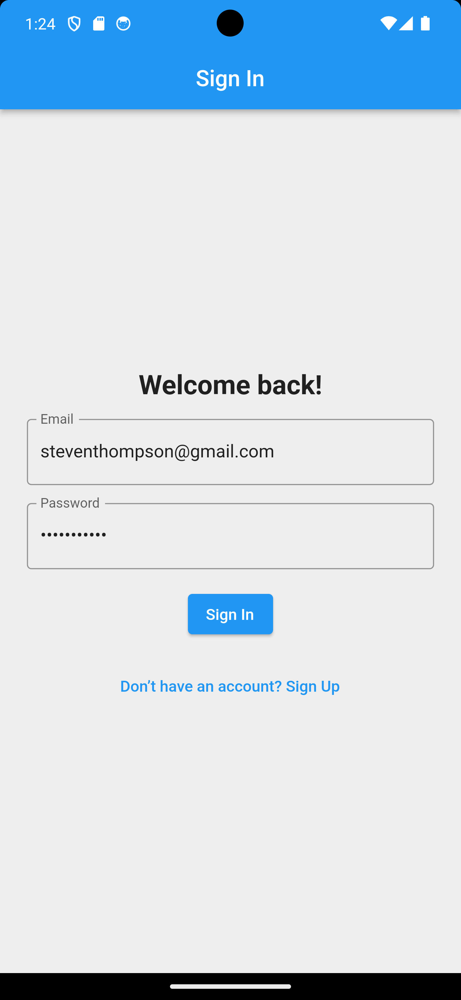
  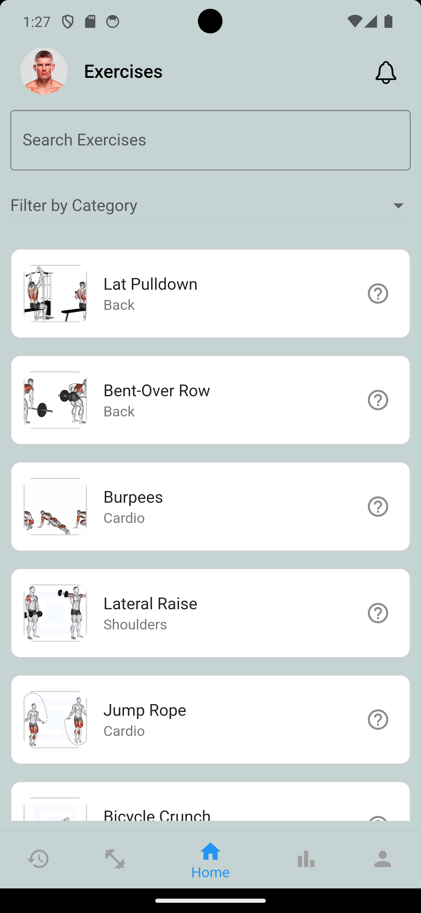
  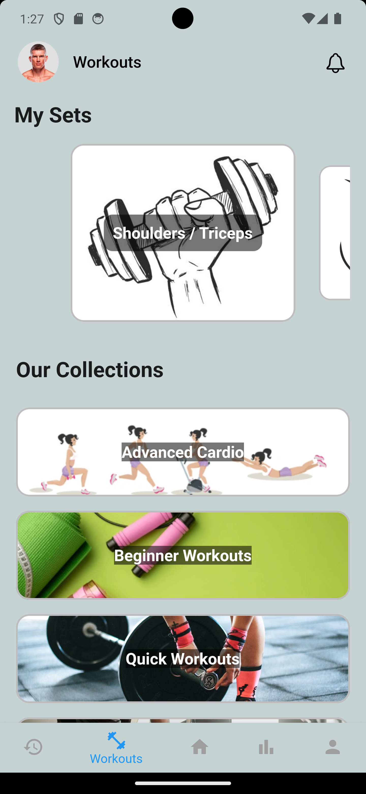
  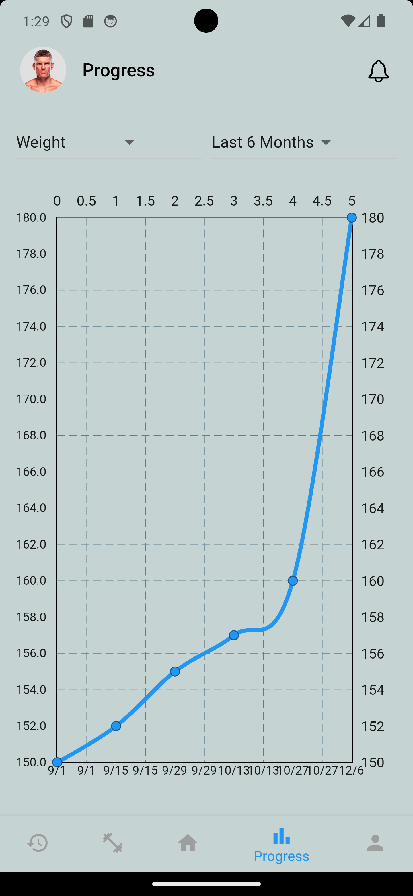

  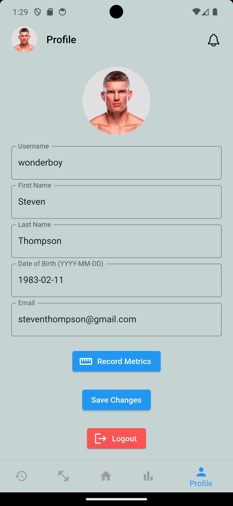
  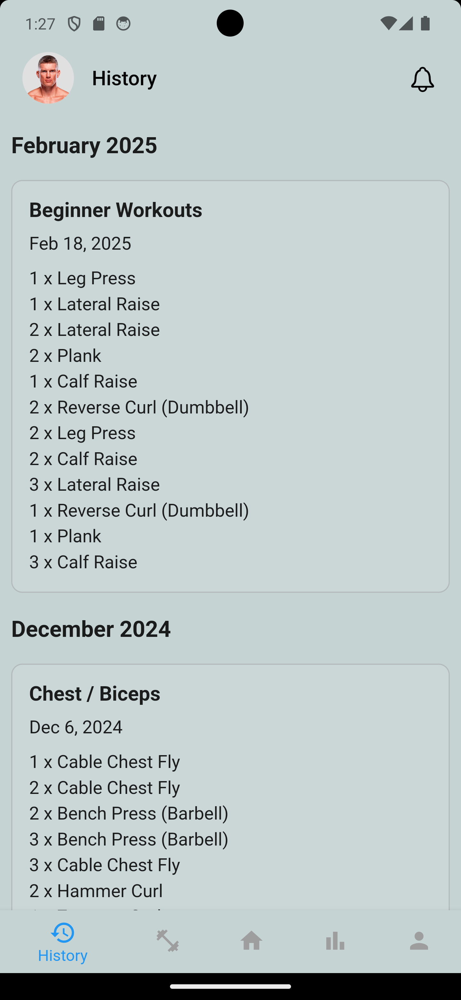
  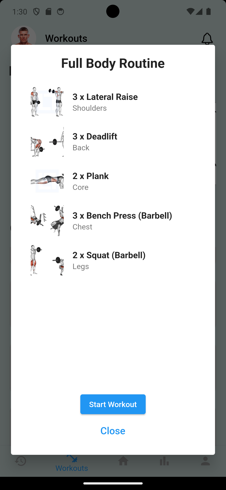
  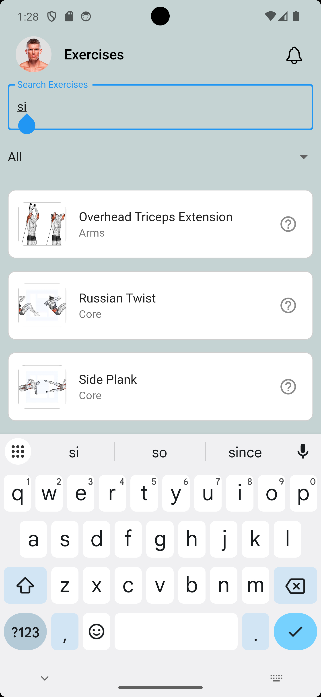

  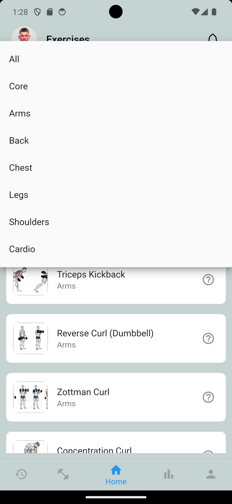
  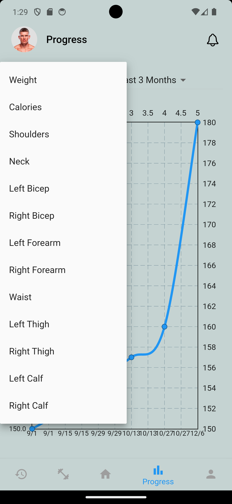
  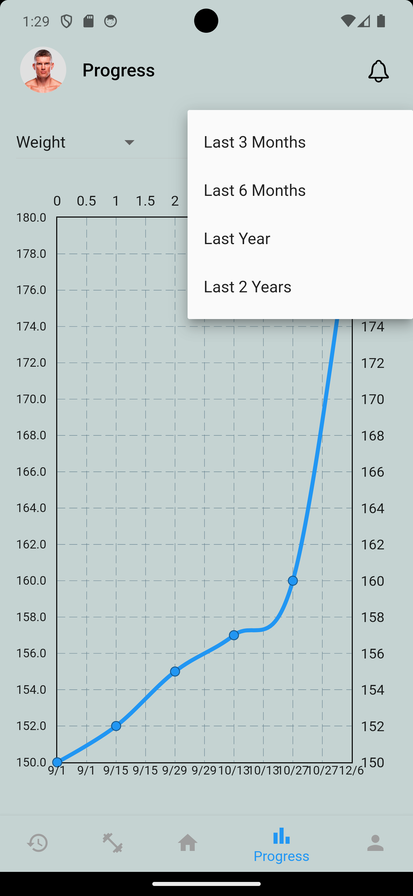
  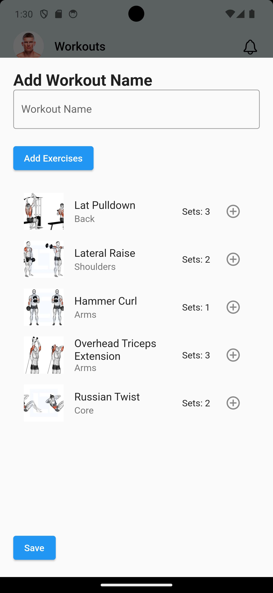

  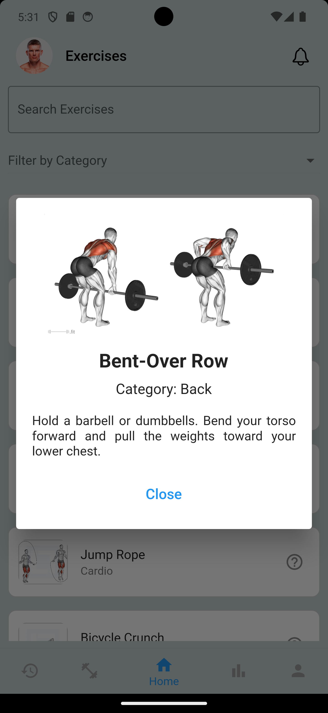
  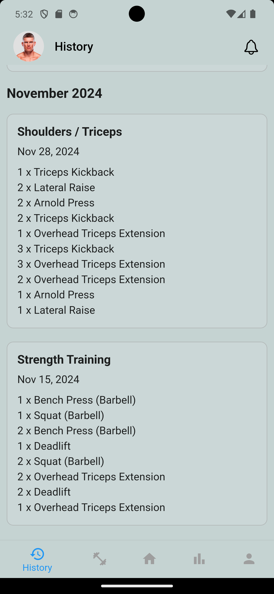
  
  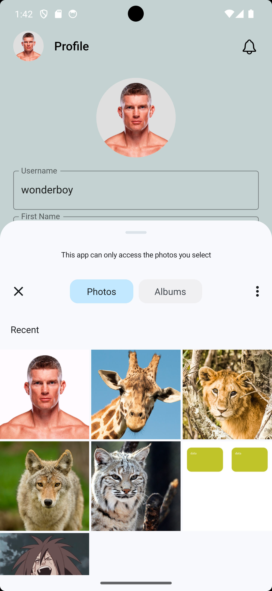

## Features
- **User Authentication** – Secure login and registration using Firebase Authentication.
- **Exercise Categorization & Search** – Exercises are grouped by body parts (e.g., Chest, Shoulders, Legs) and can be filtered or looked up by category or name.  
- **Workout Logging** – Users can log their workouts with details like exercises, sets, reps, and weights.  
- **Custom Workout Creation** – Allows users to create and save personalized workout routines.  
- **Progress Tracking** – Users can update and track their weight and other body metrics and performance over time with visual progress charts.  
- **Profile Management** – Users can update their profile picture and personal details, with changes reflected across the app.  
- **Workout Collections** – A section with pre-made workout plans or routines for users to follow.  

## Tech Stack
### Frontend
- Flutter (Dart): Cross-platform app UI development

### Backend
- Python: Data processing, analytics
- Firebase Firestore: Database
- Firebase Authentication: Handles user sign-ups, logins, and authentication.

## Contact
📧 For any questions or inquiries, feel free to reach out: [Bekzod Kimsanboev](mailto:bekzodkimsanboev@gmail.com)

